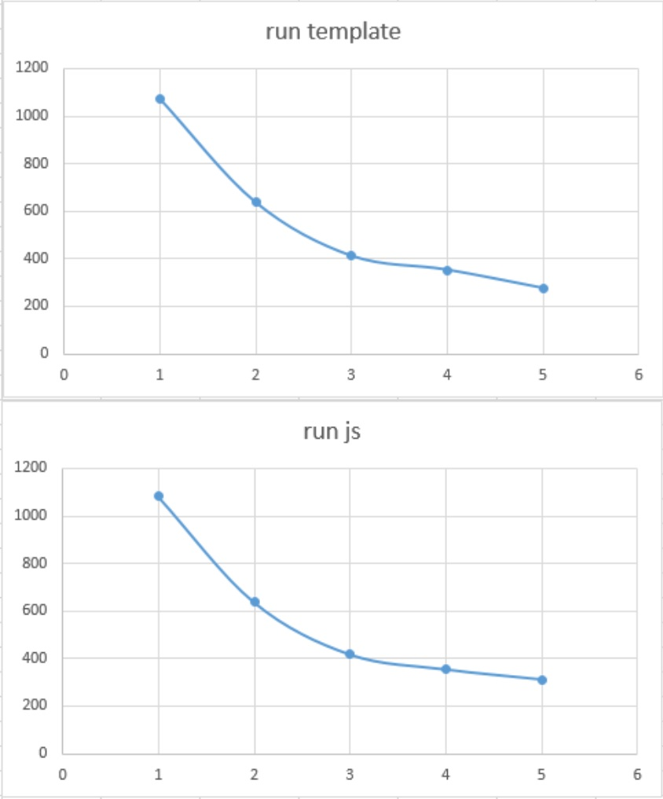

# LFU呼び出しによるlambda最適設定

具体的に LFUを利用した上でのLambdaはどんな感じでコールドスタート起動で時間がかかるのかを調査する.

またこれらの情報を元に `最良なLFU環境を導き出す` 事を目的とする.

## 構成におけるLambdaコールドスタート調査

やり方「Deploy」後コールドスタートで実行された結果をCloudWatch参照する.

あと、メモリサイズが128MByteと～1024MByte(番外でMaxの10240MByteを含む)でそれぞれ計測してみる.

これを調べる理由としてLambdaの場合、メモリサイズがUPすると、CPUスペックもUPするそうなので、それによってどれくらいパフォーマンスが変わるかを調査する.

また 調査対象は CPUは ARM を利用している。

理由としては `最大 34% 優れた料金パフォーマンスを実現` とあるので、こちらを利用想定.

### Lambdaのコスト詳細

コストは[AWSのサイト](https://docs.aws.amazon.com/ja_jp/whitepapers/latest/how-aws-pricing-works/aws-lambda.html)にあるように
> AWS Lambda の無料利用枠には、1 か月あたり 100 万件の無料リクエストと、1 か月あたり 40 万 GB-s のコンピューティングタイムが含まれている

とあるので

- 40万 GByte
  - 128MByte = 3125000秒 / 868時間(約36日) １ヶ月.
  - 256MByte = 1562500秒 / 434時間(約18日) １ヶ月.
  - 512MByte = 781250秒 / 217時間(約9日) １ヶ月.
  - 1024MByte = 390625秒 / 108時間(約4.5日) １ヶ月.
  - 10240MByte = 39062秒 / 10.8時間(約0.45日) １ヶ月.

が無料枠で利用することができる.

無料枠が終わったとしても

- コンピューティングタイム
  - 0.00001667 USD/GB 秒 
  なので、たとえば１つのLambdaを１日ずっと動かすとした場合.
    - 128MByte = 0.18436USD
    - 256MByte = 0.36871USD
    - 512MByte = 0.73742USD
    - 1024MByte = 1.47485USD
    - 10240MByte = 14.7485USD

- リクエスト毎
  - 0.0000002 USD/リクエスト 
  なので、100万回リクエスト
    - 0.20 USD

となるので、基本的に動かすLambdaのメモリが多ければ多いほど、単価が高くなる.

しかし、それほどアクセスが無い社内向けのシステム程度なら、Maxの10240MByteでも、１ヶ月無料枠でいけそうな感じがする.

### CloudWatch値とブラウザ返却値との差

コールドデプロイ後.

cloudWatchにある実行時間をブラウザ受信時間から除くと以下の余剰時間範囲.

- 300msec から 600msecぐらい

この部分については、メモリ設定とはあまり関係ない感じ.

またコールドスタートもどうやら２種類あるようで

- 300msec前後 
  一度コールドスタートした後、短時間(1分未満)で、再デプロイした場合.
- 600msec前後 
  前回のコールドスタートから数分経過して「コールド化」したものを呼び出した場合.

## それぞれの処理内容でのメモリ別実行時間

ここでの内容は cloudWatchで出力される時間を掲載.

### (min)最小限のLambdaの関数URL呼び出し

index.js の handler呼び出しでレスポンス返却.

~~~js
exports.handler = async (event, context) => {
    return {
        "statusCode": 200,
        "body": "{\"result\": \"ok\"}"
    }
}
~~~

- 128MByte: 12msec
- 256MByte: 3msec
- 512MByte: 4msec
- 1024MByte: 3msec
- 10240MByte: 3msec

256MByte以上はそれほど変わらない.

### (min2) /~ping 呼び出し

(index.js).handler() => (LFUSetup.js).start();

ここで特殊なアクセス `/~ping` 最速呼び出し.

- 128MByte: 120msec
- 256MByte: 59msec 
  大体2倍の速度アップ(コストベースで1)
- 512MByte: 15msec 
  大体8倍の速度アップ(コストベースで2)
- 1024MByte: 11msec 
  大体11倍の速度アップ(コストベースで1.42)
- 10240MByte: 10msec 
  大体12倍の速度アップ(コストベースで0.15)

### (html) /test.htmlを読み込む(github先)

github上のコンテンツをHTPSClientで取得返却.

- 128MByte: 850msec
- 256MByte: 600msec 
  大体1.42倍の速度アップ(コストベースで0.71)
- 512MByte: 395msec 
  大体2.15倍の速度アップ(コストベースで0.53)
- 1024MByte: 314msec 
  大体2.6倍の速度アップ(コストベースで0.32)
- 10240MByte: 303msec 
  大体2.81倍の速度アップ(コストベースで0.03)

### (run js) /test を読み込む(github先 => サーバjs実行)

github上のコンテンツからHTPSClientで取得したjsを実行返却.

- 128MByte: 1083msec
- 256MByte: 637msec 
  大体1.7倍の速度アップ(コストベースで0.85)
- 512MByte: 417msec 
  大体2.6倍の速度アップ(コストベースで0.64)
- 1024MByte: 354msec 
  大体3倍の速度アップ(コストベースで0.38)
- 10240MByte: 312msec 
  大体3.47倍の速度アップ(コストベースで0.04)

### (run template) /test.jhtml を読み込む(github先 => サーバjhtml実行)

github上のコンテンツからHTPSClientで取得したjs.htmlを実行返却.

- 128MByte: 1074msec
- 256MByte: 637msec 
  大体1.69倍の速度アップ(コストベースで0.84)
- 512MByte: 411msec 
  大体2.61倍の速度アップ(コストベースで0.65)
- 1024MByte: 352msec 
  大体3倍の速度アップ(コストベースで0.38)
- 10240MByte: 275msec 
  大体3.9倍の速度アップ(コストベースで0.05)

## わかりやすくTable表示

|spec|min|min2|html|run js|run template|
|---:|--:|---:|---:|-----:|-----------:|
|128|12|120|850|1083|1074|
|256|3|59|600|637|637|
|512|4|15|395|417|411|
|1024|3|11|314|354|352|
|10240|3|10|303|312|275|

## 調査結果からLFUに最適なメモリサイズを検討する

今回やりたかった事は、メモリサイズによって、CPUスペックが具体的にどのように変わるのかを知りたかった.

そしてこれらを知った上で、LFU環境での最適なメモリーサイズを知りたかった.

LFU環境での最適なメモリーサイズ条件としては

1. htmlなど静的コンテンツ返却がコールドスタート時点で１秒未満
2. 速度UPとコストベースで一番効率の良いもの
3. 最悪jsを実行する(run js or run template) は、処理に比例して遅くても可

これらから一番LFU環境に最適なもの.

- 512MByte

グラフを見るとよく分かる.

1. 128MByte
2. 256MByte
3. 512MByte
4. 1024MByte
5. 10240MByte

これを見ると一目瞭然で、3の512MByteと4の1024MByteのグラフがなだらかである事.

メモリ量を上げても、この辺でCPU速度は頭打ちになると言う事を示している.

理由の詳細

- HTML(静的コンテンツ)
  - 512MByte: 395msec 
    大体2.15倍の速度アップ(コストベースで0.53)

なので、項１の条件にギリギリの範囲(max 1.1秒)であること

次に

- run js
  - 512MByte: 395msec 
    大体2.15倍の速度アップ(コストベースで0.53)
  - 1024MByte: 314msec 
    大体2.6倍の速度アップ(コストベースで0.32)

や

- run template
  - 512MByte: 411msec 
    大体2.61倍の速度アップ(コストベースで0.65)
  - 1024MByte: 352msec 
    大体3倍の速度アップ(コストベースで0.38)

これらの速度差がそれほど変わらない(２倍コストが違うのに速度差は約85%)ので、これが最適環境であると考えられた.

LFU環境において、特別な理由が無い場合は `メモリ: 512MByte` が良さそう.

## 注意事項

LFU環境では、基本的に `aws-sdk(v2)` は利用しないし、 `aws-sdk(v3)` も利用を想定していない.

その理由として `aws-sdk(v2)`と 関数URLなLambdaの相性は最悪で、コールドスタート後に `aws-sdk(v2)` をrequireして利用する場面において 128MByteのメモリだと `5000msec` 以上も 読み込みに時間がかかる.

なので LFU環境で当初 `aws-sdk(v2)` を使って実装していたのだが、さすがに HTML返却をするだけで `5000msec` 以上かかるのは「使い勝手が悪すぎる」ので、自前で `aws signature(v4)` を作り、それを利用した `rest api` 経由でS3にアクセスするように実装しなおした.

これによって、コールドスタートでも「なんとか利用できる」環境が作れたので、ここでの調査と最適な結果はあくまで `aws-sdk(v2)` は使わない事を前提とした事を改めて注意事項として記載した次第.
